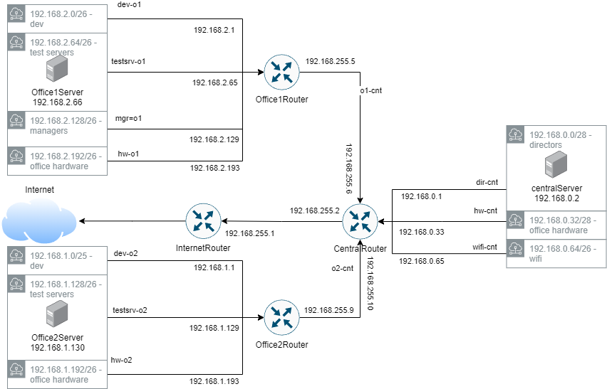

## OTUS Administrator Linux. Professional ДЗ №16: Архитектура сетей

**Задание**

[Vagrantfile с начальным построением сети](./Vagrantfile.initial):

- inetRouter
- centralRouter
- centralServer

1. построить следующую архитектуру

   - Сеть office1

     - 192.168.2.0/26 - dev
     - 192.168.2.64/26 - test servers
     - 192.168.2.128/26 - managers
     - 192.168.2.192/26 - office hardware

   - Сеть office2

     - 192.168.1.0/25 - dev
     - 192.168.1.128/26 - test servers
     - 192.168.1.192/26 - office hardware

   - Сеть central
     - 192.168.0.0/28 - directors
     - 192.168.0.32/28 - office hardware
     - 192.168.0.64/26 - wifi

```
Office1 ---\
----> Central --IRouter --> internet
Office2----/
```

Итого должны получится следующие сервера

- inetRouter
- centralRouter
- office1Router
- office2Router
- centralServer
- office1Server
- office2Server

**1. Теоретическая часть**

1. Найти свободные подсети
2. Посчитать сколько узлов в каждой подсети, включая свободные
3. Указать broadcast адрес для каждой подсети
4. проверить нет ли ошибок при разбиении

**2. Практическая часть**

1. Соединить офисы в сеть согласно схеме и настроить роутинг
2. Все сервера и роутеры должны ходить в инет черз inetRouter
3. Все сервера должны видеть друг друга
4. у всех новых серверов отключить дефолт на нат (eth0), который вагрант поднимает для связи
5. при нехватке сетевых интервейсов добавить по несколько адресов на интерфейс

_(\*) - выполнить все пункты_

**_Решение_**

1. Теория

   Информация о сетях:
   | Статус | Адрес сети | Количество узлов | Broadcast |
   |--------|------------|------------------|-----------|
   |Занят|192.168.0.0/28|14|192.168.0.15|
   |Свободен|192.168.0.16/28|14|192.168.0.31|
   |Занят|192.168.0.32/28|14|192.168.0.47|
   |Свободен|192.168.0.48/28|14|192.168.0.63|
   |Занят|192.168.0.64/26|62|192.168.0.127|
   |Свободен|192.168.0.128/25|126|192.168.0.255|
   |Занят|192.168.2.0/26|62|192.168.2.63|
   |Занят|192.168.2.64/26|62|192.168.2.127|
   |Занят|192.168.2.128/26|62|192.168.2.191|
   |Занят|192.168.2.192/26|62|192.168.2.255|
   |Занят|192.168.1.0/25|126|192.168.1.127|
   |Занят|192.168.1.128/26|62|192.168.1.191|
   |Занят|192.168.1.192/26|62|192.168.1.255|

   Ошибок, приводящих к неработоспособности нет. Однако нумерация офисов отличается от нумерации сетей.

2. Практика

   Схема сети:
   

Задание выполнено при помощи vagrant. Конфигурация сети сохранена в network-scripts, а также применена в runtime.
